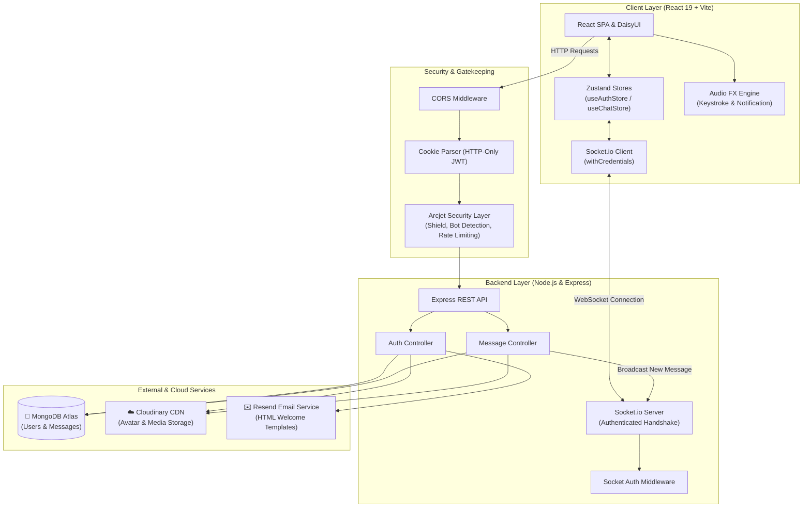

<div align="center">

# 💬 Chatify — Real-Time Chat Platform

**A full-stack, enterprise-grade real-time messaging platform engineered for seamless communication.**  
_Powered by React 19, Node.js, Express, Socket.io, MongoDB, Tailwind CSS, DaisyUI, and Zustand._

[](https://react.dev/)
[](https://vitejs.dev/)
[](https://nodejs.org/)
[](https://expressjs.com/)
[](https://socket.io/)
[](https://www.mongodb.com/)
[](https://tailwindcss.com/)
[](https://daisyui.com/)
[](https://zustand.docs.pmnd.rs/)
[](https://cloudinary.com/)
[](https://resend.com/)
[](https://arcjet.com/)

<br />

<br />

|                             🔐 Login Screen                              |                              📝 Sign Up Screen                              |
| :----------------------------------------------------------------------: | :-------------------------------------------------------------------------: |
|  |  |

</div>

---

## 🌟 Overview & Feature Highlights

**Chatify** is a modern, responsive, real-time messaging application designed with high performance, elegant aesthetics, and production-grade security in mind. It pairs a **Node.js & Express REST API** and **Socket.io WebSocket server** with a **React 19 single-page application**, providing instantaneous two-way message delivery, media exchange, presence tracking, and immersive interactive audio effects.

### ✨ Key Capabilities

- ⚡ **Real-Time Bidirectional Messaging**: Ultra-low latency chat powered by Socket.io with optimistic UI updates for instant feedback.
- 🟢 **Live Online Presence Indicators**: Real-time broadcast of active/offline status across all connected clients via an in-memory socket map.
- 🎧 **Interactive Audio FX & Mechanical Keystrokes**: Realistic mechanical switch sound effects on every keystroke (4 randomized sound profiles) and incoming message chime with persistent local storage audio toggle.
- 🔐 **Stateless JWT Cookie Authentication**: Secure, zero third-party auth dependency using HTTP-only cookies, salted password hashing (`bcryptjs`), and protected route guards.
- 📨 **Automated HTML Welcome Emails**: Onboarding emails dispatched via the **Resend API** upon user registration.
- 🗂️ **Cloud Image Uploads**: Share images directly in chats and customize profile avatars with automatic base64 encoding and CDN optimization via **Cloudinary**.
- 🚦 **Enterprise Security & Rate Limiting**: Application-level defense powered by **Arcjet**:
  - **Shield**: Blocks common web application attacks (SQL/NoSQL injections).
  - **Bot Detection**: Detects automated scraping and spoofed bots.
  - **Sliding Window Rate Limiter**: 100 requests / 60 seconds to eliminate spam and DoS attempts.
- 🎨 **Modern Dark Neon Design System**: Built with Tailwind CSS and DaisyUI featuring glassmorphism, animated glowing borders (`BorderAnimatedContainer`), and sleek responsive layouts.
- 🧠 **Reactive State Management**: Decoupled, lightweight global state stores powered by **Zustand** (`useAuthStore` and `useChatStore`).
- 🚀 **Full-Stack Single-Repository Build**: Root-level build script configured for zero-friction deployment on Sevalla, Render, Railway, or VPS.

---

## 🏛️ System Architecture



---

## 🗄️ Database Models & Schemas

Data persistence is managed through **MongoDB** and **Mongoose** with optimized query indexes:

### 1. User Model (`models/User.js`)

| Field                     | Type       | Attributes                | Description                           |
| :------------------------ | :--------- | :------------------------ | :------------------------------------ |
| `_id`                     | `ObjectId` | Primary Key               | Unique user identifier                |
| `email`                   | `String`   | Required, Unique, Trimmed | User email address for authentication |
| `fullName`                | `String`   | Required                  | User display name                     |
| `password`                | `String`   | Required, Min length 6    | Salted bcrypt hash                    |
| `profilePic`              | `String`   | Default: `""`             | Cloudinary CDN secure URL             |
| `createdAt` / `updatedAt` | `Date`     | Timestamps                | Auto-generated document timestamps    |

### 2. Message Model (`models/Message.js`)

| Field                     | Type       | Attributes                | Description                              |
| :------------------------ | :--------- | :------------------------ | :--------------------------------------- |
| `_id`                     | `ObjectId` | Primary Key               | Unique message identifier                |
| `senderId`                | `ObjectId` | Ref: `User`, Required     | Sender user reference                    |
| `receiverId`              | `ObjectId` | Ref: `User`, Required     | Recipient user reference                 |
| `text`                    | `String`   | Max length: 2000, Trimmed | Text body of the message                 |
| `image`                   | `String`   | Optional                  | Cloudinary CDN URL for image attachments |
| `createdAt` / `updatedAt` | `Date`     | Timestamps                | Auto-generated document timestamps       |

---

## ⚡ WebSocket Events (Socket.io)

Real-time communication is established over an authenticated WebSocket connection verified via HTTP-only cookies during the handshake:

| Event Name       | Direction                | Payload                        | Description                                                      |
| :--------------- | :----------------------- | :----------------------------- | :--------------------------------------------------------------- |
| `connection`     | Client ⇄ Server          | Cookie Header                  | Validates JWT token and registers user in `userSocketMap`        |
| `getOnlineUsers` | Server ➔ All Clients     | `string[]` (Array of user IDs) | Broadcasts list of active user IDs on connect/disconnect         |
| `newMessage`     | Server ➔ Receiver Client | `Message` object               | Delivers newly created message directly to recipient's socket ID |
| `disconnect`     | Client ⇄ Server          | —                              | Deregisters user from socket map and re-broadcasts online status |

---

## 📡 REST API Reference

All backend API routes are prefixed with `/api`. Protected routes require a valid JWT token in an HTTP-only cookie (`jwt`).

### Authentication (`/api/auth`)

| Method | Endpoint                   | Protection    | Description                                                      |
| :----- | :------------------------- | :------------ | :--------------------------------------------------------------- |
| `POST` | `/api/auth/signup`         | Arcjet        | Register a new account, issue JWT cookie & trigger welcome email |
| `POST` | `/api/auth/login`          | Arcjet        | Validate credentials and issue JWT cookie                        |
| `POST` | `/api/auth/logout`         | None          | Clear JWT authentication cookie                                  |
| `PUT`  | `/api/auth/update-profile` | JWT Protected | Upload new profile image to Cloudinary and update user record    |
| `GET`  | `/api/auth/check`          | JWT Protected | Verify session validity and return current user profile          |

### Messages (`/api/messages`)

| Method | Endpoint                 | Protection   | Description                                                      |
| :----- | :----------------------- | :----------- | :--------------------------------------------------------------- |
| `GET`  | `/api/messages/contacts` | Arcjet + JWT | Retrieve all registered users excluding the authenticated user   |
| `GET`  | `/api/messages/chats`    | Arcjet + JWT | Retrieve users with whom the authenticated user has chat history |
| `GET`  | `/api/messages/:id`      | Arcjet + JWT | Retrieve full chronological message thread with another user     |
| `POST` | `/api/messages/send/:id` | Arcjet + JWT | Send message (text/image) and emit `newMessage` socket event     |

---

## 📂 Project Directory Structure

```text
chat-app/
├── package.json              # Monorepo build & deployment orchestrator
├── README.md                 # Complete project documentation
├── backend/                  # Node.js & Express API + Socket.io Server
│   ├── package.json
│   ├── .env.example
│   └── src/
│       ├── server.js         # Entry point & HTTP/Socket server lifecycle
│       ├── controllers/
│       │   ├── auth.controller.js       # Signup, login, logout, profile updates
│       │   └── message.controller.js    # Message history, contacts & send message
│       ├── emails/
│       │   ├── emailHandlers.js         # Resend transactional email trigger
│       │   └── emailTemplates.js        # Responsive HTML welcome template
│       ├── lib/
│       │   ├── arcjet.js                # Rate limiting & bot shield configuration
│       │   ├── cloudinary.js            # Cloudinary SDK client
│       │   ├── db.js                    # MongoDB connection helper
│       │   ├── env.js                   # Environment variable loader & checks
│       │   ├── resend.js                # Resend client initializer
│       │   ├── socket.js                # Socket.io server instance & socket map
│       │   └── utils.js                 # JWT cookie generation utility
│       ├── middleware/
│       │   ├── arcjet.middleware.js     # Rate limiting & attack shield middleware
│       │   ├── auth.middleware.js       # HTTP request JWT validation
│       │   └── socket.auth.middleware.js# WebSocket handshake JWT validation
│       ├── models/
│       │   ├── Message.js               # Message Mongoose model
│       │   └── User.js                  # User Mongoose model
│       └── routes/
│           ├── auth.route.js            # Auth route definitions
│           └── message.route.js         # Messaging route definitions
└── frontend/                 # React 19 + Vite Frontend SPA
    ├── package.json
    ├── vite.config.js
    ├── tailwind.config.js    # Tailwind & DaisyUI configuration
    ├── index.html
    ├── public/
    │   ├── screenshot-for-readme.png
    │   ├── login.png
    │   ├── signup.png
    │   ├── avatar.png
    │   └── sounds/           # Audio assets for mechanical keys & alerts
    │       ├── keystroke1.mp3
    │       ├── keystroke2.mp3
    │       ├── keystroke3.mp3
    │       ├── keystroke4.mp3
    │       ├── mouse-click.mp3
    │       └── notification.mp3
    └── src/
        ├── App.jsx           # App layout, background effects & routing
        ├── main.jsx          # React DOM root mounting
        ├── index.css         # Custom animations & base styles
        ├── components/       # Reusable modular UI components
        │   ├── ActiveTabSwitch.jsx
        │   ├── BorderAnimatedContainer.jsx
        │   ├── ChatContainer.jsx
        │   ├── ChatHeader.jsx
        │   ├── ChatsList.jsx
        │   ├── ContactList.jsx
        │   ├── MessageInput.jsx
        │   ├── MessagesLoadingSkeleton.jsx
        │   ├── NoChatHistoryPlaceholder.jsx
        │   ├── NoChatsFound.jsx
        │   ├── NoConversationPlaceholder.jsx
        │   ├── PageLoader.jsx
        │   ├── ProfileHeader.jsx
        │   └── UsersLoadingSkeleton.jsx
        ├── hooks/
        │   └── useKeyboardSound.js      # Mechanical keystroke audio hook
        ├── lib/
        │   └── axios.js                 # Axios instance with credentials
        ├── pages/
        │   ├── ChatPage.jsx             # Master chat dashboard
        │   ├── LoginPage.jsx            # Login form page
        │   └── SignUpPage.jsx           # Registration form page
        └── store/
            ├── useAuthStore.js          # Auth, session & socket state
            └── useChatStore.js          # Chats, messages & audio state
```

---

## 🚀 Getting Started & Local Setup

### Prerequisites

- **Node.js** >= 20.0.0
- **npm** >= 9.x
- **MongoDB** connection string (Local or MongoDB Atlas)
- Free tier API keys for **Cloudinary**, **Resend**, and **Arcjet**

### 1. Clone the Repository

```bash
git clone https://github.com/webfox12/chat-app.git
cd chat-app
```

### 2. Configure Environment Variables

Navigate to the `backend/` directory and create your `.env` file:

```bash
cd backend
cp .env.example .env
```

Fill in the configuration keys:

```env
PORT=3000
NODE_ENV=development
CLIENT_URL=http://localhost:5173

MONGO_URI=mongodb+srv://<username>:<password>@cluster0.mongodb.net/chat_db?retryWrites=true&w=majority
JWT_SECRET=your_super_secret_jwt_key_at_least_32_characters

RESEND_API_KEY=re_your_resend_api_key
EMAIL_FROM=onboarding@resend.dev
EMAIL_FROM_NAME="Chatify Team"

CLOUDINARY_CLOUD_NAME=your_cloudinary_cloud_name
CLOUDINARY_API_KEY=your_cloudinary_api_key
CLOUDINARY_API_SECRET=your_cloudinary_api_secret

ARCJET_KEY=ajkey_your_arcjet_key
ARCJET_ENV=development
```

### 3. Install Dependencies & Run Development Servers

Open two terminal windows:

#### Terminal 1 — Backend:

```bash
cd backend
npm install
npm run dev
```

_Backend server will start listening on `http://localhost:3000`._

#### Terminal 2 — Frontend:

```bash
cd frontend
npm install
npm run dev
```

_Vite dev server will start on `http://localhost:5173`._

---

## 🛠️ Production Build & Deployment

The root `package.json` contains automated monorepo scripts for cloud platforms like **Sevalla**, **Render**, **Railway**, or **Heroku**:

```bash
# Installs backend & frontend dependencies, then builds production SPA
npm run build

# Starts production server (serves API and compiled frontend SPA)
npm start
```

When `NODE_ENV=production`, Express automatically serves static assets from `frontend/dist` and routes all non-API paths to `index.html`.

---

## 📄 License

This project is open-source software licensed under the [MIT License](LICENSE).
